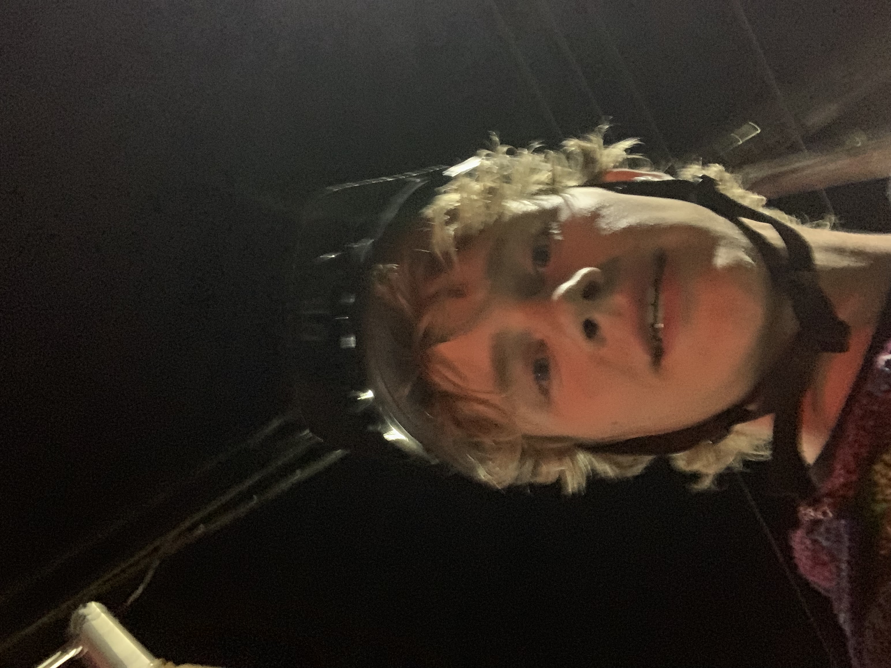

# READIT

**Who am I?**
Well, my name is Dominic
here's a photo of me: 

As most of the people in the class, I am majoring in **Neuroscience**, with this being my fourth (and hopefully the last) year. 
I enrolled into this course because I recently took a computer science course and realized I enjoyed playing around with Java, so I figured I'd try to learn something more applicable to both my program and real life data!

I'm interested in neuroscience from my dad. He was in the Navy for awhile and developed neurological issues and I've always been fascinated by his treatments, etc.

I plan on becoming a **Physiotherapist**! My goal is to get into it next year, but it is pretty competitive so we'll have to see.

